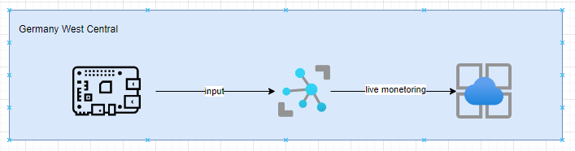

# Azure IoT Hub Web Application for Weather Monitoring

## Overview

This project demonstrates an Azure IoT Hub-based web application designed for live weather monitoring using Raspberry Pi as the primary sensor device. The application captures temperature and humidity data from the Raspberry Pi, sends it to Azure IoT Hub, and visualizes it on a web dashboard in real-time.

## Features

* **Real-Time Data Capture:** Weather sensor data (temperature and humidity) is sent continuously from a Raspberry Pi device.
* **Azure IoT Hub Integration:** IoT Hub receives and processes the incoming telemetry data.
* **Data Visualization:** A web application displays live temperature and humidity readings in an intuitive graphical interface.
* **Cloud-Based Architecture:** Deployed in the Germany West Central region for robust and scalable data processing.

## Architecture

### Components:

1. **Raspberry Pi:**
   * Collects weather data (temperature and humidity) via sensors.
   * Transmits data to the Azure IoT Hub.
2. **Azure IoT Hub:**
   * Acts as a message broker between the Raspberry Pi and cloud-based services.
   * Processes incoming telemetry data for storage and analysis.
3. **Web Application:**
   * Visualizes the processed data in real-time using a line graph for temperature (°C) and humidity (%).
   * Displays user-friendly insights about weather conditions.
4. **Azure Services:**
   * Facilitates live data monitoring.
   * Stores and processes data for future analysis
5. Scrrenshot
    


### Data Flow:

1. Sensor data is generated by the Raspberry Pi device.
2. Data is transmitted to the Azure IoT Hub.
3. IoT Hub processes and forwards the data for live monitoring.
4. A web application fetches the data for real-time visualization.

## Screenshots

### Logs:

The application captures and logs the incoming data messages. Example log snippet:

```
{"messageId":5,"deviceId":"Raspberry Pi Web Client","temperature":31.89,"humidity":66.01}
{"messageId":6,"deviceId":"Raspberry Pi Web Client","temperature":26.50,"humidity":76.61}
...
```

### Web Application:

The web interface displays live temperature and humidity values in a line chart format. Example graph:


## Setup and Deployment

1. **Hardware Requirements:**
   * Raspberry Pi (with Wi-Fi capability)
   * DHT11 or DHT22 temperature and humidity sensor
2. **Software Requirements:**
   * Python 3 (for Raspberry Pi data collection)
   * Azure IoT SDK for Python
   * Node.js or Python-based backend for web application
3. **Azure Setup:**
   * Create an Azure IoT Hub in the Germany West Central region.
   * Register the Raspberry Pi device in the IoT Hub.
   * Set up Azure Stream Analytics (optional for extended data processing).
4. **Web Application:**
   * Deploy a Node.js or Flask-based application for data visualization.
   * Integrate with Azure IoT Hub’s endpoints to fetch real-time telemetry.

## Usage Instructions

1. Power on the Raspberry Pi and ensure it is connected to the internet.
2. Run the Python script on the Raspberry Pi to send sensor data to Azure IoT Hub.
3. Open the web application to view live weather data.
4. Use the graph to analyze trends in temperature and humidity over time.

## Benefits

* **Scalability:** Supports multiple IoT devices simultaneously.
* **Real-Time Insights:** Enables users to monitor environmental conditions as they change.
* **Reliability:** Leverages Azure’s robust cloud infrastructure.

## Future Enhancements

* Add data storage for historical trend analysis.
* Implement alerts for extreme weather conditions.
* Integrate AI models for predictive analytics based on collected data.

---

For further information, please refer to Azure IoT Hub documentation or contact the development team.

## pi test client

https://azure-samples.github.io/raspberry-pi-web-simulator/#GetStarted
